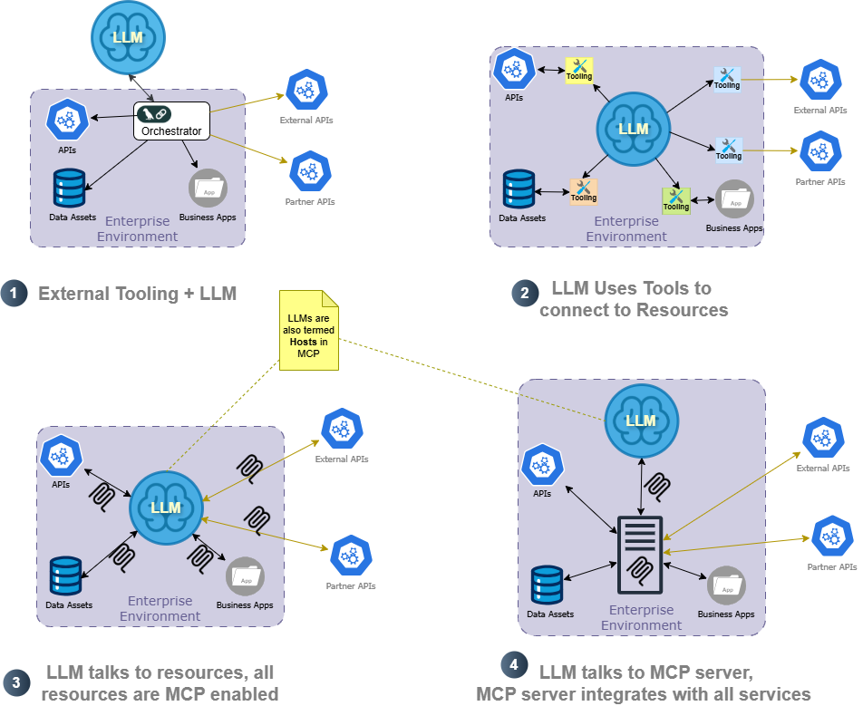

# Tool Chains, MCP, A2A, and Other Developments
<!-- TOC -->
* [Tool Chains, MCP, A2A, and Other Developments](#tool-chains-mcp-a2a-and-other-developments)
  * [The Coming of AI Agents](#the-coming-of-ai-agents)
  * [Experiments with Agents](#experiments-with-agents)
    * [Techniques of Agent Implementations](#techniques-of-agent-implementations)
    * [Single Agent vs. A2A](#single-agent-vs-a2a)
      * [Tool-chaining with an external LLM](#tool-chaining-with-an-external-llm)
      * [LLM with Tooling](#llm-with-tooling)
      * [LLM with MCP](#llm-with-mcp)
      * [LLMs with MCP Server](#llms-with-mcp-server)
  * [An Illustrative Example: CRM Automation Agent](#an-illustrative-example-crm-automation-agent)
    * [HubSpot Taskbot - Level-1 Agents](#hubspot-taskbot---level-1-agents)
    * [HubSpot FlowBot - Level-2 Agent](#hubspot-flowbot---level-2-agent-)
    * [HubSpot InsightBot - Level-3 Agent](#hubspot-insightbot---level-3-agent)
  * [Further Topics to Explore](#further-topics-to-explore)
    * [Cost Analysis](#cost-analysis)
    * [A2A Complexity](#a2a-complexity)
<!-- TOC -->

> Live content of the entry [here](https://github.com/Mildogrc/agent-evolution/blob/blogs/blogs/agent_application.md).

Significant advancements in AI have occurred in the past four years, and their influence on humanity's future is substantial and enduring. The pace of growth of AI capabilities is startling. It is alarming enough to warrant copious inspection and abundant introspection.

## The Coming of AI Agents

> For the topic of this discussion: The term *agents*, along with the terms *autonomous agents*, or *AI agents*, refers to standalone decision-making system that leverages LLMs. 

[AI Agents are at the forefront](https://globalventuring.com/corporate/information-technology/corporates-rush-to-invest-in-ai-agents/)  of AI implementation projects owing to the ease of building components that can perform operations requiring language, reasoning, logical deduction, pattern recognition, and other areas that were historically [considered humans' forte](https://arxiv.org/html/2404.01869v2).  In the beginning, LLMs were pattern matches that learned the statistical relevance between words and chatbots that generated coherent volumes of textual responses. The emergence of LLMs as drivers of autonomous agents was due to 1/ stronger reasoning, 2/ instruction following, 3/ tool-use rationale, and 4/ code-generation. These changes were brought about in LLMs as a [series of improvements](https://arxiv.org/abs/2206.07682) with techniques such as

- [Scaling up models]( https://arxiv.org/abs/2005.14165) enabled capabilities beyond pattern-matching
- *[Transformers (attention mechanism)](https://arxiv.org/abs/1706.03762)* that allowed capturing long-range dependencies
- instruction tuning with high-quality reasoning Q&As *cf.* [FLAN collection](https://research.google/blog/google-research-2022-beyond-language-vision-and-generative-models/) 
- [Chain-of-Thought (CoT) prompting](https://arxiv.org/abs/2201.11903) that shows steps before answering

## Experiments with Agents

This blog post also aims to share our findings from experimenting with agents. Our efforts to build agents of all complexities are available on GitHub  [here](https://github.com/Mildogrc/agent-evolution). Our POV is that the agents can perform significant operations autonomously and be progressively classified from Level-1 to Level-5 based on problem/solution complexity. The goal is to keep this entry *'live'* updated with trial results.

### Techniques of Agent Implementations
So far, engineers have envisioned a few different ways of building agents; let us look at the four most popular techniques. A typical implementation involves [tool-calling libraries](https://python.langchain.com/v0.1/docs/modules/agents/concepts/) that orchestrate operations using an LLM and APIs (for example, using [langchain](https://python.langchain.com/docs), an LLM itself invoking tools or APIs (for instance, [Amazon Bedrock](https://aws.amazon.com/blogs/machine-learning/harness-the-power-of-mcp-servers-with-amazon-bedrock-agents/) or any such agents that use [MCP](https://docs.anthropic.com/en/docs/agents-and-tools/mcp)), and [multi-agents](https://cloud.google.com/discover/what-are-ai-agents), where many LLM-based or SLM-based agents interacting with each other (for instance, using [A2A](https://developers.googleblog.com/en/a2a-a-new-era-of-agent-interoperability/).) 

----

----

The above diagram depicts the four most common patterns of agent deployment.

#### Tool-calling with an external LLM
In this setup, an *orchestrator* (a custom tool-call chain) implements the logic while integrating with all enterprise assets and LLMs—a naive approach wherein only a few aspects of LLM are employed. The orchestrator retains the bulk of the logic, most of the business flow, and all integrations. Many RAG and classical AI use cases typically employ this use case.

#### LLM with Tooling
In this setup, the LLM drives the agent's functionality. The LLM uses reasoning to decide on a sequence of actions and employs the tools provided. Typically, custom tooling is built to enable LLMs to leverage enterprise assets. All endpoints of enterprise assets—REST APIs, data stores, and partner APIs—get custom tooling to allow LLMs to discover, connect to, and leverage them.

#### LLM with MCP
[*"The Model Context Protocol (MCP) is an open standard that facilitates seamless integration between LLM applications and external data sources or tools."*](https://modelcontextprotocol.io/specification/2025-03-26/index)
In this utopian setup, every enterprise asset is already MCP-enabled and exposes an MCP endpoint. LLM can now discover these MCP endpoints and use the relevant enterprise assets to execute the required use cases. 

#### LLMs with MCP Server
This is a  *middle-ground* implementation, wherein an MCP server, similar to an API gateway, exposes MCP endpoints, abstracting the complex integrations behind the server. 

## An Illustrative Example: CRM Automation Agent
Our rudimentary implementations involved building CRM agents and demonstrating their capabilities.  We chose to implement agents that can *manage customer relations* to demonstrate the possibilities of implementing increasingly complex agents. The toolset we chose was Python, Google ADK, Ollama, and Llama/Gemma/Gemini-Flash. The CRM solution was HubSpot. 

### HubSpot Taskbot - Level-1 Agents

As part of building a Level-1 agent (which we term `taskbots`), we built a CRM client agent. TaskBots are aimed at automating simple, rule-based tasks. Employing LLMs or SLMs to leverage targeted features, such as language understanding, conversational ability, and content generation, to achieve repetitive workflows with minimal decision-making.

The idea was that an agent could look at emails from clients (or potential clients), automatically extract the relevant information, and update the CRM. Our efforts are in [this GitHub repo](https://github.com/Mildogrc/agent-evolution/). An outline of our implementation efforts is this:
1. We built code that is capable of creating and managing leads. We exposed two Python functions, `create_lead()`, to create a new lead in HubSpot, and `create_meeting()`, to set up a meeting with the new lead. These functions took the necessary information in a key-value format `{email:"<>", firstname:"", lastname:""...}`
2. We wrote an agent prompt asking it to parse an email from a potential lead, find the relevant data, and call the tooling to create an entry in HubSpot.

### HubSpot FlowBot - Level-2 Agent 
A FlowBot improves upon a TaskBot by implementing a multistep flow. 

In the CRM example, a FlowBot, besides entering the lead, also works to find a good time on the lead's calendar for further steps (discussion, demo, or any such encounter). We could add more steps to a FlowBot's workflow, increasing its complexity. For instance, the flowbot could use tools to gather more data and insights about the client and update the CRM. It could transcribe the calls and add the details and sentiment of the call to the CRM software.

### HubSpot InsightBot - Level-3 Agent
InsightBots augment and list the potential paths with insights based on real-time findings.

In the CRM example, InsightBot plans a strategy to handle the lead. InsightBot might look at the leads holistically, do a background check, and devise the best way to handle them. Then, InsightBot prompts an approver to determine whether the plan needs changes or is good to execute. Once the approver finalizes the plan, InsightBot will manage it.

## Further Topics to Explore

The experiments sparked interesting insights and thought-provoking discussions, which need further exploration and will be part of future blog posts.

### Cost Analysis
An interesting facet is analyzing the costs of various agent implementation patterns. Agents have both savings and overhead. The savings are in speed, agility, and elasticity; however, the price is the risks of bad decisions, missed actions, and computational complexity. What is the right balance? Individual enterprises will have to evaluate this before implementing the solution.

### A2A Complexity
We realize that multi-agent solutions (with A2A) are complicated. Many of the challenges of distributed computing (consensus problems, Byzantine faults, stabilization challenges) are amplified because of LLM challenges, such as hallucinations and a lack of context. 

Interestingly, many design principles of building systems apply in designing agent-based automation. Should there be a single agent capable of doing the entire workflow? Should many agents be cooperating? How will the agents cooperate? *(Cf. orchestration and choreography in microservices architecture)*

We will treat A2A in later blog posts.
