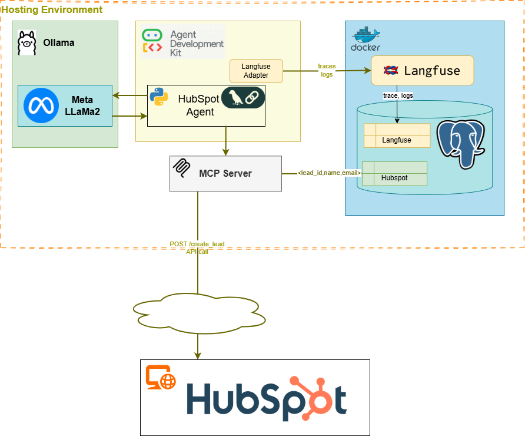

# Tool Chains, MCP, A2A, and Other Developments
<!-- TOC -->
* [Tool Chains, MCP, A2A, and Other Developments](#tool-chains-mcp-a2a-and-other-developments)
  * [The Coming of AI Agents](#the-coming-of-ai-agents)
  * [Experiments with Agents](#experiments-with-agents)
    * [Techniques of Agent Implementations](#techniques-of-agent-implementations)
      * [Tool-calling with an external LLM](#tool-calling-with-an-external-llm)
      * [LLM with Tooling](#llm-with-tooling)
      * [LLM with MCP](#llm-with-mcp)
      * [LLMs with MCP Server](#llms-with-mcp-server)
    * [Comparison of Approaches](#comparison-of-approaches)
      * [Control vs Flexibility](#control-vs-flexibility)
      * [Development complexity](#development-complexity)
      * [Cost](#cost)
      * [Reliance on LLM Reasoning](#reliance-on-llm-reasoning)
  * [Security of AI Agents](#security-of-ai-agents)
  * [Observability of Agents](#observability-of-agents)
    * [History of Monitoring Agents](#history-of-monitoring-agents)
    * [Tools and Frameworks](#tools-and-frameworks)
  * [An Illustrative Example: CRM Automation Agent](#an-illustrative-example-crm-automation-agent)
    * [HubSpot Taskbot - Level-1 Agents](#hubspot-taskbot---level-1-agents)
    * [HubSpot FlowBot - Level-2 Agent](#hubspot-flowbot---level-2-agent-)
    * [HubSpot InsightBot - Level-3 Agent](#hubspot-insightbot---level-3-agent)
    * [Level-4 Agents (NeuroBots) and Level-5 Agents (AGI)](#level-4-agents-neurobots-and-level-5-agents-agi)
  * [Further Topics to Explore](#further-topics-to-explore)
    * [Cost Analysis](#cost-analysis)
    * [A2A Complexity](#a2a-complexity)
<!-- TOC -->

> Live content of the entry [here](https://github.com/Mildogrc/agent-evolution/blob/blogs/blogs/agent_application.md).

Significant advancements in AI have occurred in the past four years, and their influence on humanity's future is substantial and enduring. The pace of growth of AI capabilities is startling. It is alarming enough to warrant copious inspection and abundant introspection.

## The Coming of AI Agents

> For the topic of this discussion: The term *agents*, along with the terms *autonomous agents*, or *AI agents*, refers to standalone decision-making system that leverages LLMs. 

 [AI Agents are at the forefront](https://globalventuring.com/corporate/information-technology/corporates-rush-to-invest-in-ai-agents/)  of AI implementation projects owing to the ease of building components that can perform operations requiring language, reasoning, logical deduction, pattern recognition, and other areas that were historically [considered humans' forte](https://arxiv.org/html/2404.01869v2).  In the beginning, LLMs were pattern matches that learned the statistical relevance between words and chatbots that generated coherent volumes of textual responses. The emergence of LLMs as drivers of autonomous agents was due to 1/ stronger reasoning, 2/ instruction following, 3/ tool-use rationale, and 4/ code-generation. These changes were brought about in LLMs as a [series of improvements](https://arxiv.org/abs/2206.07682) with techniques such as

- [Scaling up models]( https://arxiv.org/abs/2005.14165) enabled capabilities beyond pattern-matching
- *[Transformers (attention mechanism)](https://arxiv.org/abs/1706.03762)* that allowed capturing long-range dependencies
- instruction tuning with high-quality reasoning Q&As *cf.* [FLAN collection](https://research.google/blog/google-research-2022-beyond-language-vision-and-generative-models/) 
- [Chain-of-Thought (CoT) prompting](https://arxiv.org/abs/2201.11903) that shows steps before answering.

This series of blogs is an attempt to capture our experiments with developing agents: tools, techniques, challenges, and best practices.

> It is interesting to note that the original ideas for building AI based autonomous software, which learns by observing and training, is 30+ years old!. For example, the paper *Modeling Adaptive Autonomous Agents* by Pattie Maes, published in early 1990s, defines adaptive, autonomous, and intelligent agents. She proposes that an intelligent system that can effectively monitor and learn from observation its environment rather than requiring explicit programming or complex symbolic logic. Though we have made massive strides in technology today, some of the problems identified decades ago are still relevant.

## Experiments with Agents

This blog post also aims to share our findings from experimenting with agents. Our efforts to build agents of all complexities are available on GitHub  [here](https://github.com/Mildogrc/agent-evolution). Our POV is that the agents can perform significant operations autonomously. Furthermore, they could be progressively classified from Level-1 to Level-5 based on problem/solution complexity and autonomy. The goal is to keep this entry *'live'* updated with trial results.

### Techniques of Agent Implementations
So far, engineers have envisioned a few different ways of building agents; let us look at the four most popular techniques. A typical implementation involves [tool-calling libraries](https://python.langchain.com/v0.1/docs/modules/agents/concepts/) that orchestrate operations using an LLM and APIs (for example, using [langchain](https://python.langchain.com/docs), an LLM itself invoking tools or APIs (for instance, [Amazon Bedrock](https://aws.amazon.com/blogs/machine-learning/harness-the-power-of-mcp-servers-with-amazon-bedrock-agents/) or any such agents that use [MCP](https://docs.anthropic.com/en/docs/agents-and-tools/mcp)), and [multi-agents](https://cloud.google.com/discover/what-are-ai-agents), where many LLM-based or SLM-based agents interacting with each other (for instance, using [A2A](https://developers.googleblog.com/en/a2a-a-new-era-of-agent-interoperability/).) 

----

----

The above diagram depicts the four most common patterns of agent deployment.

#### Tool-calling with an external LLM
In this setup, an *orchestrator* (a custom tool-call chain) implements the logic while integrating with all enterprise assets and LLMs—a foundational approach that uses a simple integration pattern, wherein only a few aspects of LLM are employed. The orchestrator retains the bulk of the logic, most of the business flow, and all integrations. Many RAG and classical AI use cases typically employ this use case.

#### LLM with Tooling
In this setup, the LLM drives the agent's functionality. The LLM uses reasoning to decide on a sequence of actions and employs the tools provided. Typically, custom tooling is built to enable LLMs to leverage enterprise assets. All endpoints of enterprise assets—REST APIs, data stores, and partner APIs—get custom tooling to allow LLMs to discover, connect to, and leverage them.

#### LLM with MCP
[*"The Model Context Protocol (MCP) is an open standard that facilitates seamless integration between LLM applications and external data sources or tools."*](https://modelcontextprotocol.io/specification/2025-03-26/index)
In this fully integrated vision, every enterprise asset is already MCP-enabled and exposes an MCP endpoint. LLM can now discover these MCP endpoints and use the relevant enterprise assets to execute the required use cases. 

#### LLMs with MCP Server
This is a  *middle-ground* implementation, wherein an MCP server, similar to an API gateway, exposes MCP endpoints, abstracting the complex integrations behind the server. 

### Comparison of Approaches
#### Control vs Flexibility
#### Development complexity
#### Cost
#### Reliance on LLM Reasoning

Papers on Autonomous AI, self-improving systems, long-term AI strategy - research papers.

## Security of AI Agents

## Observability of Agents
Similar to ML and LLM-based solutions, agentic solutions need monitoring, debugging, and operational oversight. This requirement becomes extremely important in situations such as multi-agents, where the interactions cannot be definitely known beforehand. Many techniques of monitoring and managing are proposed, varying from custom tooling to building special monitoring agents (which are themselves based on LLMs/SLMs).

### History of Monitoring Agents
The requirement to monitoring autonomous agents is an ongoing field of research, starting from [NASA's projects to space](http://www.ai.mit.edu/courses/6.834J-f01/Williams-remote-agent-aij98.pdf) to robotics to now AI agents. Foundational work for observability can be found in [DARPA's work in creating explainable AI](https://www.darpa.mil/research/programs/explainable-artificial-intelligence), symbolic/rule-based policies to create interpretable RL ([XRL](https://github.com/Plankson/awesome-explainable-reinforcement-learning)), and trying to define formal methods to verify agent behaviors.
This is a nascent field, with much research ongoing.

### Tools and Frameworks
At the time of writing this, there were many commercial and open-source options. 
Of the many, we focused on two notable ones that piggyback on OpenTelemetry: [Langfuse](https://aws.amazon.com/blogs/apn/transform-large-language-model-observability-with-langfuse/) and [TraceLoop's OpenLLMetry](https://www.traceloop.com/openllmetry).
LangFuse is an open-source framework that tracks inference, retrieved embeddings, API and tool usage, etc., Specifically for agents, LangFuse provides features such as tracing intermediate steps, debugging failures, evaluating responses, and providing benchmarks.
OpenLLMetry is also an open-source framework adds LLM-specific metrics to OpenTelemetry: both performance metrics (such as latency, token usage, error rates) and behavior metrics (prompts, workflows, metadata).

Though there are other popular open source with more capabilities such as [Helicone](https://helicone.ai), [Arize Phoenix](https://arize.com), [AgentOps](https://agentops.ai), it is better to choose a tool that is OpenTelemetry compatible. Most enterprises will already have infrastructure compatible with OpenTelemetry, and also most cloud and service providers are usually OpenTelemetry compatible. Read OpenTelemetry's comments on this topic [here](https://opentelemetry.io/blog/2025/ai-agent-observability/).

Refer to our git repo for examples on how to use Langfuse.

## An Illustrative Example: CRM Automation Agent
Our rudimentary implementations involved building CRM agents and demonstrating their capabilities.  We chose to implement agents that can *manage customer relations* to demonstrate the possibilities of implementing increasingly complex agents. The toolset we chose was Python, Google ADK, Ollama, and Llama/Gemma/Gemini-Flash. The CRM solution was HubSpot. 

### HubSpot Taskbot - Level-1 Agents

As part of building a Level-1 agent (which we term `taskbots`), we built a CRM client agent. TaskBots are aimed at automating simple, rule-based tasks. Employing LLMs or SLMs to leverage targeted features, such as language understanding, conversational ability, and content generation, to achieve repetitive workflows with minimal decision-making.

The idea was that an agent could look at emails from clients (or potential clients), automatically extract the relevant information, and update the CRM. Our efforts are in [this GitHub repo](https://github.com/Mildogrc/agent-evolution/). An outline of our implementation efforts is this:
1. We built code that is capable of creating and managing leads. We exposed two Python functions, `create_lead()`, to create a new lead in HubSpot, and `create_meeting()`, to set up a meeting with the new lead. These functions took the necessary information in a key-value format `{email:"<>", firstname:"", lastname:""...}`
2. We wrote an agent prompt asking it to parse an email from a potential lead, find the relevant data, and call the tooling to create an entry in HubSpot.

We have two different implementations of Level-1 Agents: 1/ A Google ADK based implementation that directly discovers and uses tools to create a lead based on emails, and 2/ an agent implementation that uses the same tools via an MCP server.

---

| Level-1 Agent with direct tool-calling                                 | Level-1 Agent that uses MCP |
|------------------------------------------------------------------------|---|
|  |  |

---

### HubSpot FlowBot - Level-2 Agent 
A FlowBot improves upon a TaskBot by implementing a multistep flow. 

In the CRM example, a FlowBot, besides entering the lead, also works to find a good time on the lead's calendar for further steps (discussion, demo, or any such encounter). We could add more steps to a FlowBot's workflow, increasing its complexity. For instance, the flowbot could use tools to gather more data and insights about the client and update the CRM. It could transcribe the calls and add the details and sentiment of the call to the CRM software.

### HubSpot InsightBot - Level-3 Agent
InsightBots augment and list the potential paths with insights based on real-time findings. 

In the CRM example, InsightBot plans a strategy to handle the lead. InsightBot might look at the leads holistically, do a background check, and devise the best way to handle them. Then, InsightBot prompts an approver to determine whether the plan needs changes or is good to execute. Once a human/admin finalizes the plan, InsightBot will manage it. 

Given the complexity of such an endeavor, this is a moonshot.

### Level-4 Agents (NeuroBots) and Level-5 Agents (AGI)
The agent implementations could get further complex and more autonomous. A level-4 agent could coordinate with multiple AI agents to optimize complex processes. A level-5 agent could execute operations with full autonomy--it could continuously adapt and self-optimize, handling complex interdependent business processes.

In the CRM example, a level-4 agent--an extremely complex agent (or set of agent) would work with sales and marketing teams, augmenting their lead-finding by learning and adopting. The agent(s) could learn about potential leads and plan lead generation with similar leads, handle nurturing, prepare proposals, and even close the deal. 

A level-5 agent, a theoretical AGI, would be fully autonomous--handle everything from creating marketing campaigns, finding leads, contacting them, planning a strategy, scheduling meetings, demoing the products or services, and attempt to make a sale. They could go further and handle customer support.

## Further Topics to Explore

The experiments sparked interesting insights and thought-provoking discussions, which need further exploration and will be part of future blog posts.

### Cost Analysis
An interesting facet is analyzing the costs of various agent implementation patterns. Agents have both savings and overhead. The savings are in speed, agility, and elasticity; however, the price is the risks of bad decisions, missed actions, and computational complexity. What is the right balance? Individual enterprises will have to evaluate this before implementing the solution.

### A2A Complexity
We realize that multi-agent solutions (with A2A) are complicated. Many of the challenges of distributed computing (consensus problems, Byzantine faults, stabilization challenges) are amplified because of LLM challenges, such as hallucinations and a lack of context. 

Interestingly, many design principles of building systems apply in designing agent-based automation. Should there be a single agent capable of doing the entire workflow? Should many agents be cooperating? How will the agents cooperate? *(Cf. orchestration and choreography in microservices architecture)*

We will treat A2A in later blog posts.
