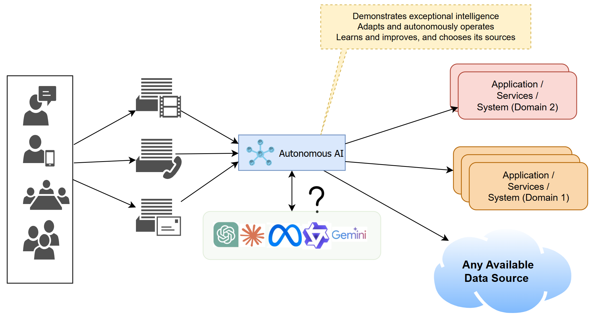

# 
_DRAFT_

#
### **AI Automation: From Simple Tasks to Full Autonomy**  

This six-part series explores the increasing sophistication of AI automation, tracing its journey from basic task execution to fully autonomous, self-optimizing systems. This document explains the various classifications of AI automation from basic to complex, broken down in increasing levels of complexity. As the sequence of actions that are based on decisioning increases, the errors increase. Systems tend to gradually drift away from the target intent as the errors compound. Constant course correcting becomes more difficult as time goes by due to errors creeping into various facets of decisions.

The next five documents in this series will respectively discuss each of these complexity levels in detail. Where possible a sample implementation is made available on github.

### AI Automation Level 1: _Task Bots_
#### Basic Automation to Streamlining Efficiency  

- **Focus:** Automates simple, rule-based tasks
- **Examples**: 
  - *Customer Email Triaging*: LLMs analyze and categorize customer emails based on content and sentiment, automatically tagging or forwarding them.
  - *Appointment Scheduling*: A GenAI-powered chatbot interprets a patient's email  and schedules with the appropriate physician.
- **Characteristics:** Ideal for repetitive workflows with minimal decision-making, improving efficiency without requiring advanced intelligence. May not need LLMs, SLMs or custom ML models might suffice. Simple enough a task chain that no human intervention is required.
- **Role of GenAI**: 
  1. _SLMs_ efficiently handle lightweight natural language queries, enabling chatbots to process common scheduling and email-related tasks. 
  2. For most parts, the task bot could use purpose-built AI services (such as vision, NLP, speech, etc.), or a combination of all of them, to attain the set task.
  3. _LLMs_ might be used for enable more nuanced interactions, such as summarizing emails or extracting action items from meeting notes.

### AI Automation Level 2: _Smart Flows_
#### Workflow Orchestration to Integrate Intelligent Decisioning   

- **Focus:** Automates multi-step workflows
- **Examples**: 
  - *CRM updates*: An LLM extracts key details from sales emails, transcribes call notes, and updates the CRM automatically.
  - *Inventory management*: AI predicts stock shortages by analyzing purchase patterns and supplier lead times, triggering automated restocking.
- **Characteristics**: Enhances efficiency by integrating multiple tools, providing actionable insights while still requiring human oversight for complex decisions.  
- **Role of GenAI**
    1. SLMs assist in structured data processing, such as categorizing incoming requests or filtering CRM updates.
  2. LLMs generate summaries of customer interactions, flagging urgent issues or recommending next-best actions.
  3. GenAI models integrate with APIs to optimize inventory planning based on demand forecasts.

### AI Automation Level 3: _Omni Solves_
#### Decision-Augmenting AI that Optimizes processes in Real-Time  

- **Focus:** Assists in decision-making through real-time data analysis for tasks 
- **Examples**: 
  - *Dynamic pricing*: AI analyzes competitor pricing, market trends, and consumer demand to adjust product prices in real-time.
  - *Fraud detection*: GenAI detects anomalies in financial transactions by analyzing historical patterns and unstructured customer interactions.
- **Characteristics:** Manages moderately complex processes across different business functions, operating with partial autonomy to optimize outcomes.  
- **Role of GenAI**
  1. SLMs work within edge environments to flag suspicious transactions without heavy computational costs.
  2. LLMs process free-text insurance claims or fraud reports, correlating them with structured data for risk assessment.
  3. GenAI models synthesize insights across pricing, demand, and fraud signals, helping businesses react dynamically.

### AI Automation Level 4: _Neuro Chains_ 
#### Autonomous Coordination and Management of Multiple Intelligent Systems

- **Focus:** Coordinates multiple AI agents to optimize complex systems 
- **Examples**: 
  - *Hospital bed management*: AI predicts patient admissions, optimizes resource allocation, and automates scheduling to maximize capacity.
  - *Supply chain logistics*: AI dynamically adjusts shipping routes based on traffic, weather, and warehouse stock levels.
- **Characteristics:** Adapts to unforeseen scenarios, employs advanced reasoning, and learns from past interactions to improve system performance over time.
- **Role of GenAI**
  1. SLMs assist in quick operational tasks like dispatch notifications and basic scheduling.
  2. LLMs analyze large datasets, predict demand surges, and suggest workflow adjustments.
  3. GenAI platforms integrate various agents (IoT sensors, logistics platforms, ERP systems) to automate decision-making with minimal human input.

### AI Automation Level 5: _Sentient AI_
#### Self-Learning & Autonomous AI – Complete Automation

- **Focus:** Executes fully autonomous operations that continuously adapt and self-optimize, handling complex interdependent business processes
- **Examples**: 
  - *AI-driven underwriting*: AI assesses risk, personalizes insurance policies, and continuously updates models based on new data.
  - *Autonomous retail*: AI-powered stores manage inventory, pricing, and checkout with minimal human intervention.
- **Characteristics:** Demonstrates exceptional intelligence, adaptability, and autonomy, maximizing efficiency. Like Level-1 no human intervention; however the class of problems is extremely complex. 
- **Role of GenAI**
  1. SLMs process customer interactions, handling routine inquiries without requiring cloud-heavy resources.
  2. LLMs analyze policyholder histories, regulatory updates, and market trends to refine underwriting decisions.
  3. GenAI platforms orchestrate self-optimizing systems, enabling AI-driven warehouses and cashier-less retail environments.

### Summary
As AI automation advances, and becomes part of solutions across all domains, it is important to be aware of the increasing complexity of decision-making, along with the opportunities and challenges it brings. Understanding these five levels of automation helps organizations anticipate potential pitfalls, optimize workflows, and implement AI-driven solutions effectively. In the upcoming documents, we will explore each level in depth, offering insights, examples, and practical implementations. Stay tuned for a deeper dive into the evolving landscape of AI automation.