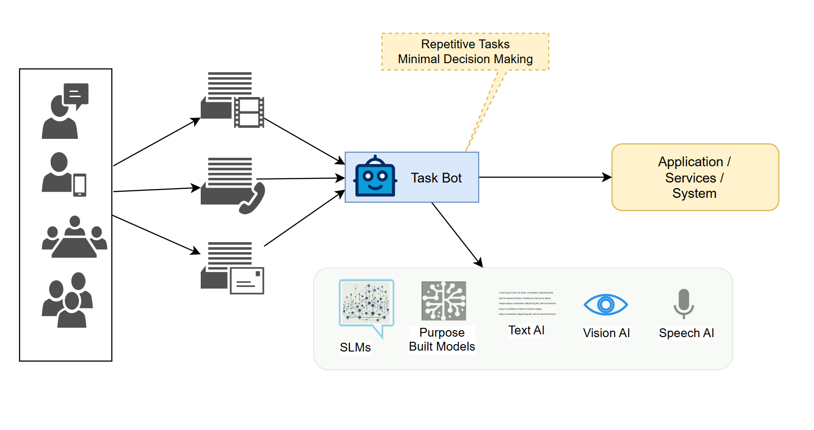
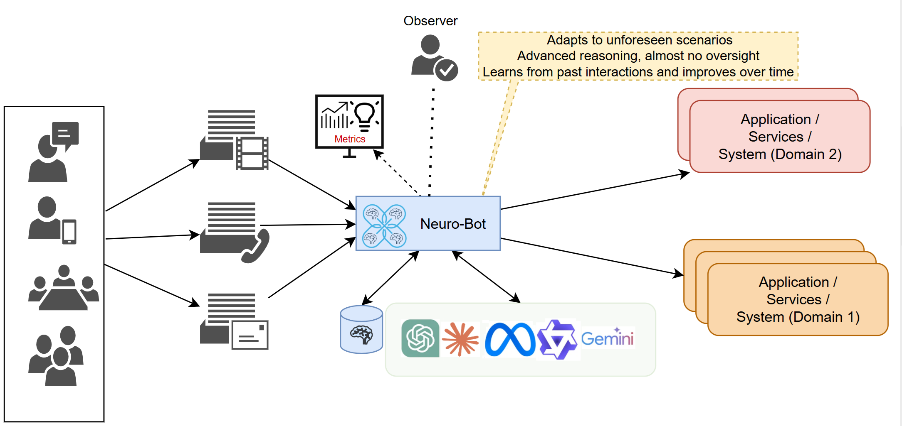

# 
_DRAFT_

## **AI Automation: From Simple Tasks to Full Autonomy**  

This six-part series explores the increasing sophistication of AI automation, tracing its journey from basic task execution to fully autonomous, self-optimizing systems. This document explains the various classifications of AI automation from basic to complex, broken down in increasing levels of complexity. As the sequence of actions that are based on decisioning increases, the errors increase. Systems tend to gradually drift away from the target intent as the errors compound. Constant course correcting becomes more difficult as time goes by due to errors creeping into various facets of decisions.

The next five documents in this series will respectively discuss each of these complexity levels in detail. Where possible a sample implementation is made available on github.

## AI Automation Level 1: _Task Bots_

### Basic Automation to Streamlining Efficiency  

- **Focus:** Automates simple, rule-based tasks
- **Examples**:
  - _Customer Email Triaging_: LLMs analyze and categorize customer emails based on content and sentiment, automatically tagging or forwarding them.
  - _Appointment Scheduling_: A GenAI-powered chatbot interprets a patient's email  and schedules with the appropriate physician.
- **Characteristics:** Ideal for repetitive workflows with minimal decision-making, improving efficiency without requiring advanced intelligence. May not need LLMs, SLMs or custom ML models might suffice. Simple enough a task chain that no human intervention is required.
- **Role of GenAI**:
  1. _SLMs_ efficiently handle lightweight natural language queries, enabling chatbots to process common scheduling and email-related tasks.
  2. For most parts, the task bot could use purpose-built AI services (such as vision, NLP, speech, etc.), or a combination of all of them, to attain the set task.
  3. _LLMs_ might be used for enable more nuanced interactions, such as summarizing emails or extracting action items from meeting notes.

## AI Automation Level 2: _Smart Flows_

### Workflow Orchestration to Integrate Intelligent Decisioning

- **Focus:** Automates multi-step workflows
- **Examples**:
  - _CRM updates_: An LLM extracts key details from sales emails, transcribes call notes, and updates the CRM automatically.
  - _Inventory management_: AI predicts stock shortages by analyzing purchase patterns and supplier lead times, triggering automated restocking.
- **Characteristics**: Enhances efficiency by integrating multiple tools, providing actionable insights while still requiring human oversight for complex decisions.  
- **Role of GenAI**
    1. SLMs assist in structured data processing, such as categorizing incoming requests or filtering CRM updates.
    2. LLMs generate summaries of customer interactions, flagging urgent issues or recommending next-best actions.
    3. GenAI models integrate with APIs to optimize inventory planning based on demand forecasts.

## AI Automation Level 3: _Omni Solves_

### Decision-Augmenting AI that Optimizes processes in Real-Time  

- **Focus:** Assists in decision-making through real-time data analysis for tasks
- **Examples**:
  - _Dynamic pricing_: AI analyzes competitor pricing, market trends, and consumer demand to adjust product prices in real-time.
  - _Fraud detection_: GenAI detects anomalies in financial transactions by analyzing historical patterns and unstructured customer interactions.
- **Characteristics:** Manages moderately complex processes across different business functions, operating with partial autonomy to optimize outcomes.  
- **Role of GenAI**
  1. SLMs work within edge environments to flag suspicious transactions without heavy computational costs.
  2. LLMs process free-text insurance claims or fraud reports, correlating them with structured data for risk assessment.
  3. GenAI models synthesize insights across pricing, demand, and fraud signals, helping businesses react dynamically.

## AI Automation Level 4: _Neuro Chains_

### Autonomous Coordination and Management of Multiple Intelligent Systems

- **Focus:** Coordinates multiple AI agents to optimize complex systems
- **Examples**:
  - _Hospital bed management_: AI predicts patient admissions, optimizes resource allocation, and automates scheduling to maximize capacity.
  - _Supply chain logistics_: AI dynamically adjusts shipping routes based on traffic, weather, and warehouse stock levels.
- **Characteristics:** Adapts to unforeseen scenarios, employs advanced reasoning, and learns from past interactions to improve system performance over time.
- **Role of GenAI**
  1. SLMs assist in quick operational tasks like dispatch notifications and basic scheduling.
  2. LLMs analyze large datasets, predict demand surges, and suggest workflow adjustments.
  3. GenAI platforms integrate various agents (IoT sensors, logistics platforms, ERP systems) to automate decision-making with minimal human input.

## AI Automation Level 5: _Sentient AI_

### Self-Learning & Autonomous AI – Complete Automation

- **Focus:** Executes fully autonomous operations that continuously adapt and self-optimize, handling complex interdependent business processes
- **Examples**:
  - _AI-driven underwriting_: AI assesses risk, personalizes insurance policies, and continuously updates models based on new data.
  - _Autonomous retail_: AI-powered stores manage inventory, pricing, and checkout with minimal human intervention.
- **Characteristics:** Demonstrates exceptional intelligence, adaptability, and autonomy, maximizing efficiency. Like Level-1 no human intervention; however the class of problems is extremely complex.
- **Role of GenAI**
  1. SLMs process customer interactions, handling routine inquiries without requiring cloud-heavy resources.
  2. LLMs analyze policyholder histories, regulatory updates, and market trends to refine underwriting decisions.
  3. GenAI platforms orchestrate self-optimizing systems, enabling AI-driven warehouses and cashier-less retail environments.

## Examples

To better understand the classification of agents, let us look at a few examples from domains that are not based on science or math--where a rule-based system will not suffice--fashion design and surgery.

### Possibilities

**A level-1 agent** solves the problem where the task can be configured or set up as a strict workflow. Uploading cloth design, and instructing agent-powered robots to cut to various sizes, or, stitching the cloth per configuration. Similarly, a surgeon might set up a robot to apply sutures, or close up a patient to finish a surgery. In these scenarios, the work can be defined as a sequence of steps--with minimal errors and deviation to the task flow.

**A level-2 agent** would increase in sophistication, where a plan is set up by an admin, and the agent drives multiple systems as per sequence. Docter would setup the sequence of events required for a surgery, or a fashion designer uploads the target fashion design, and hand-holds the agent to operate various machines.

**A level-3 agent** would further increase in sophistication, where an agent plans performing various tasks in sequences. It provides an approver with a plan, which could be altered or overriden. Agent analyzes the patient, and sets up a surgery plan. Or, given a fashion trend in a particular line of clothing, creates new designs and asks for approval or modifications.

**A level-4 agent** is mostly autonomous, planning and automatically deciding the sequence of actions. A human override is still provided by an overseer/observer, who could abort the process.

**A level-5 agent** is completely autonomous, running an entire hospital or a fashion design company.

### Analysis

Of course, such agents are long ways away; though the distant future getting closer rapidly. The example above is a futurisitic view of what AI could once achieve. However, the concepts do apply to existing domains, and such implementations are possible; albiet, at simpler levels. This git repo is an attempt to theorize, experiment, and realize such AI automation efforts.

## Summary

As AI automation advances, and becomes part of solutions across all domains, it is important to be aware of the increasing complexity of decision-making, along with the opportunities and challenges it brings. Understanding these five levels of automation helps organizations anticipate potential pitfalls, optimize workflows, and implement AI-driven solutions effectively. It is important to note that many techniques to achieve these various levels of agents are available, and new techniques are continuously formulated. Whether these agents are driven by mechanisms outside of SLM/LLMs (eg., custom langchain implementations), or driven by LLMs (eg., MCP based implementation of Anthropic, or ), or any other techniques in between, the classification is intended to be an exploration of the possible sophistication in AI automation levels.

In the upcoming documents, we will explore each level in depth, offering insights, examples, and practical implementations. Stay tuned for a deeper dive into the evolving landscape of AI automation.
